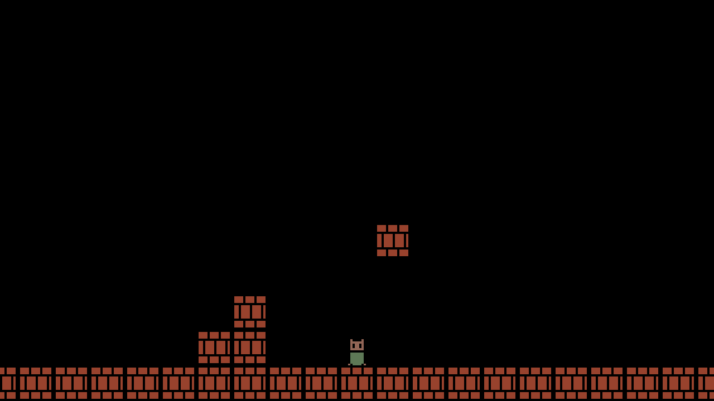

# Func Man



## Description

A small platformer "game engine" written in a purelly functional language, Haskell

This is a little project done by me just to see that it could happen.

Anyone can use this if they want, but it was really just an experiment for me as I'm learning Haskell

## Build and run

To build and run the application through stack, use:

```
stack build
stack exec game
```

Once built the application can be found at: 

./.stack-work/install/x86_64-linux-tinfo6/6c08d8bc96d8ef282a64b06cd9adcb9fa49dd9296181857d3e00def616d05fc6/8.6.5/bin/game
